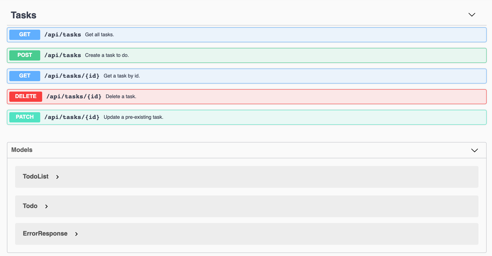

# azure-todos-api
Classic todo API implemented with ASP.NET MVC (C#), EntityFramework, and an Azure SQL database for deployment on the cloud. Provides a 'task' resource with basic CRUD abilities.

Completed as part of CSCI-E94 at Harvard University. (Assignment 2)

(I use 'task' and 'todo' interchangeably because 'tasks' already exist in C#. Namespacing helps, but will not solve potential confusion of future developers. I like to code with easy maintainability by another developer in mind. Keep it simple!)

## Configuration
To run this API, you would have to set up a real connection string in your [appsettings.Production.json](./TodosAPI/appsettings.Production.json) configuration to point to a SQL database. Entity Framework will interpret this connection string and will seed the database table with some initial values, if the table does not exist.

## Swagger Documentation
If you run this yourself, a URL path like this will open the Swagger UI:
`https://{base_url}/swagger/index.html` (currently configured to open automatically if running locally)

It should look something like this:

For reference, the swagger definition for this API is here: [swagger.json.](./swagger.json)
